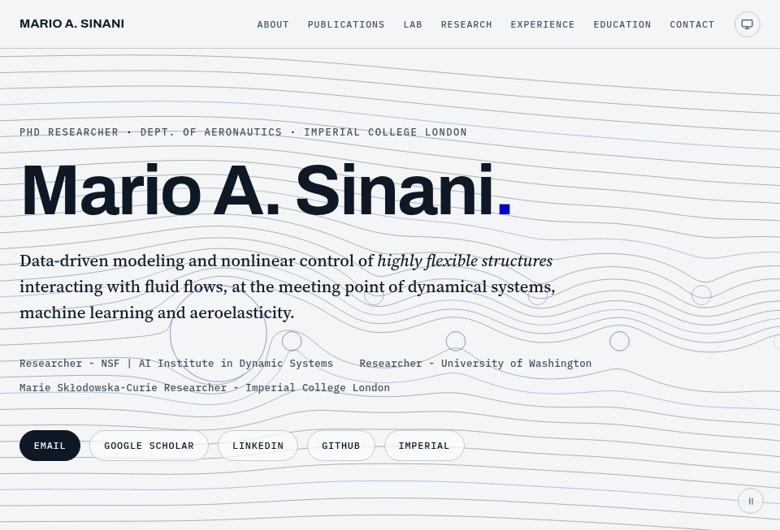

[](https://mariosinani.com)

Personal website of Mario A. Sinani.

## The pages

- [Home](https://mariosinani.com/) — the person, the themes of the work, and the recent updates
- [About](https://mariosinani.com/about/) — the biography, the interests, and the way to make contact
- [Publications](https://mariosinani.com/publications/) — each paper with its abstract, its DOI and its BibTeX
- [Lab](https://mariosinani.com/lab/) — six live models from the papers; each one runs in the browser and takes a control
- [Research](https://mariosinani.com/research/) — the themes of the work, and the papers that belong to each theme
- [Experience](https://mariosinani.com/experience/) — the positions, as a timeline
- [Education](https://mariosinani.com/education/) — the degrees, as a timeline
- [Feed](https://mariosinani.com/atom.xml) — the updates, in Atom

## Structure

```
├── about
├── assets
│   ├── fonts
│   ├── icons
│   ├── logos
│   └── og
├── atom.xml
├── CNAME
├── css
├── education
├── experience
├── js
│   └── scenes
├── lab
├── publications
├── research
├── tools
└── index.html
```

## Checks

```
python3 tools/check.py        # pages, links, classes, sitemap, imports, preloads
python3 tools/preloads.py --write   # write the preload list of each page again
node tools/test-scenes.mjs    # the models against the numbers of the papers
node tools/test-engine.mjs    # the engine: the loop, the pause and the fixed frame
node tools/trace.mjs          # each scene against its recorded fingerprint
node tools/trace.mjs --write  # record the fingerprints again after a change
```

`tools/trace.mjs` draws each scene into a stub context and hashes the
calls, so a refactor that changes no behaviour keeps the same hash. The
same checks run on each push, in `.github/workflows/checks.yml`.

## Local development

```sh
python3 -m http.server 8080
```

then open <http://localhost:8080>. Edit and refresh.

This server sends no cache instruction, so a browser can keep an old
stylesheet or an old module and show the page in the wrong shape. Give
the page a hard reload after a change to a file in `css/` or in `js/`:
Ctrl+Shift+R, or Cmd+Shift+R on a Mac.
